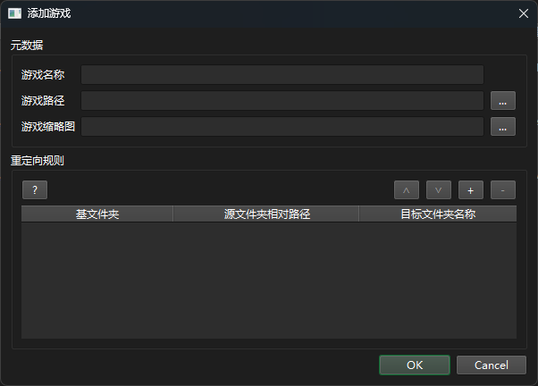
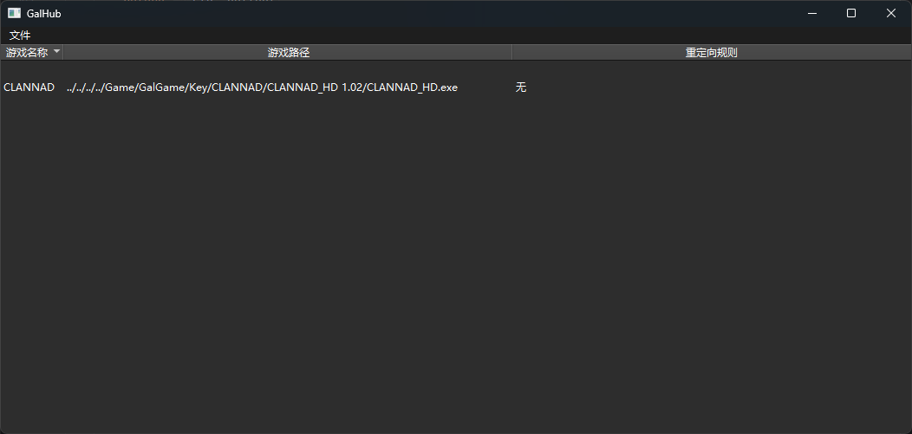
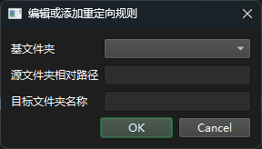
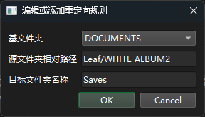

> [!WARNING]
> 
> GalHub 处于早期测试阶段，可能会对你的存档造成损坏。
>
> GalHub 未进行充分的测试，某些 GalGame 可能无法运行，可以在 issue 中反馈

## 简介

存档收集小工具，可以将散落在各处的 GalGame 存档收集在一个文件夹中，非常适合移动硬盘用户

使用 MinHook 和 DLL 注入来实现路径的重定向

目前还在开发中

## 如何使用

下载最新版本软件，解压后放在合适的位置，打开 GalHub.exe

### 添加游戏

点击菜单栏 > 文件 > 添加游戏，会出现添加游戏界面



输入游戏名称，选择游戏路径即可（游戏缩略图可以不选）

点击 OK 即可在主界面看到游戏：



### 编辑和删除游戏

在主界面对于特定游戏右键选择“编辑”即可进入编辑界面

在主界面对于特定游戏右键选择“删除”即可删除该游戏的配置

### 添加和编辑重定向规则

GalHub 会按照重定向规则进行路径的重定向，在添加游戏或者编辑游戏界面，第二个栏目就是“重定向规则”

点击加号按钮即可创建一个重定向规则，双击某个重定向规则即可编辑它，这时会进入这个界面：



每个规则包含三个东西：基文件夹、源文件夹相对路径、目标文件夹名称。代表从“%基文件夹%/源文件夹相对路径”到“Env/游戏名/目标文件夹名称”的重定向

例如，如果想要从“文档/Leaf/WHITE ALBUM2”映射到“Saves”文件夹，我们可以这样选：



下面是基文件夹的含义：

| 基文件夹变量       | 含义                                    |
| ------------------ | --------------------------------------- |
| USER_PROFILE       | C://Users/<你的用户名>                  |
| DESKTOP            | “桌面”文件夹                            |
| DOCUMENTS          | “文档”文件夹                            |
| DOWNLOADS          | “下载”文件夹                            |
| MUSIC              | “音乐”文件夹                            |
| PICTURES           | “图片”文件夹                            |
| VIDEOS             | “视频”文件夹                            |
| SAVED_GAMES        | “保存的游戏”文件夹                      |
| ROAMING_APP_DATA   | C://Users/<你的用户名>/AppData/Roaming  |
| LOCAL_APP_DATA     | C://Users/<你的用户名>/AppData/Local    |
| LOCAL_LOW_APP_DATA | C://Users/<你的用户名>/AppData/LocalLow |
| GAME               | 你的游戏 exe 文件所在的文件夹           |

## 如何从源码构建

### 克隆代码仓库

由于项目包含子模块，所以最好使用克隆而不是直接下载

```bat
git clone --recursive git@github.com:MilkFeng/GalHub.git
```


### 配置 Qt6 环境

最好使用静态链接 Qt

1. 安装 Qt6-MSVC，如果想要静态链接 Qt，则需自行编译 Qt（或者下载别人构建好的包，例如 https://build-qt.fsu0413.me）
2. 找到类似 C:\Qt\6.5.3\Qt6.5.3-Windows-x86_64-VS2022-17.10.0-staticFull 这样的目录
3. 将 build.bat 中的 QT6_PATH 变量设置成找到的目录

### 配置 Visual Studio 环境

Visual Studio 版本最好与前面 Qt 的版本一致

1. 安装对应版本的 Build Tools：打开 https://learn.microsoft.com/en-us/visualstudio/releases/2022/release-history 页面，下载对应版本的 Build Tools 安装工具
2. 打开安装工具，安装“使用 C++ 的桌面开发”相关的组件
3. 找到类似 C:\Program Files (x86)\Microsoft Visual Studio\2022\BuildTools\VC\Auxiliary\Build\vcvarsall.bat 的文件
4. 将 build.bat 中的 VC_VARS_BAT 变量设置成找到的文件

### 构建

打开根目录，执行 build.bat 即可

```bat
./build.bat
```

构建脚本可以有三个开关：debug、clean、run，如果想打开对应的开关，将它作为参数传给 build.bat 即可

例如，如果想要全新编译，并在编译完成后运行，使用

```bat
./build.bat clean run
```

### 安装

构建完后，会将构建产物放到 dist 文件夹下，构建产物有：

- GalHub.exe
- Bin/Hook-x86.dll
- Bin/Hook-x64.dll
- Bin/Helper.exe

## 感谢

- https://github.com/SegaraRai/PathRedirector 中使用 MinHook 对 ntdll 中的文件方法进行 Hook
- https://github.com/SegaraRai/InjectExec 中实现了 DLL 注入
